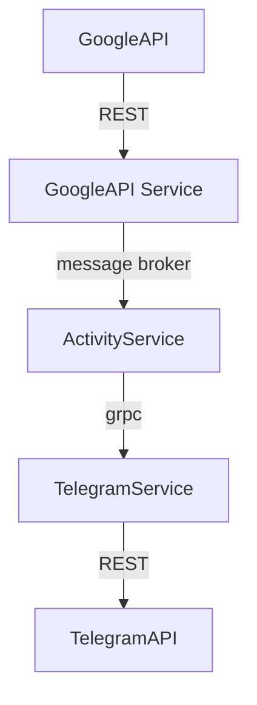
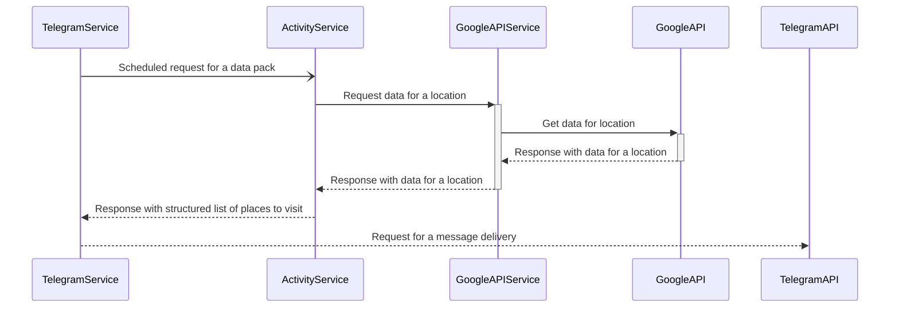

# Where To Telegram Bot

The purpose of the project is to be overengineered. We want to practice as many non-required-by-business-goals technologies as possible. Few, but not all of those include: message brokers, grpc protocol, k8s and microservice architecture and monitoring.

## Suggested app architecture

### Chart

### Sequence

## Notes on app's architecture

The idea is to overengineer the app the way we communicate with maximum possible ways between our services. At the end of app's business goal cycle the `TelegramService` uses a `Spring` scheduler to send a message in Telegram.

## k8s and monitoring

We would add a couple of additional services for monitoring of our apps. I consider Prometheus for metrics monitoring and Grafana for visual representation of the metrics. At the same time we could add report portal to review test runs results. Oooh, almost forgot `ELK` for logging. By the moment we already have 9 services to run. In a perfect case scenario our apps should be able to scale. At the same time it would be perfect to set up a vpn for maintenance services.

## Services to consider

* `Hashicorp vault`

## Implementation plan

* [X] Create a `Mermaid` high-level sequence diagram on the way the business-level services should communicate with each other
* [ ] Create a `Mermaid` diagram of business and monitoring services 
* [ ] Analyze the creation of those three business logic services and decompose the tasks into GH issues (it would be nice to set up issues templates first)
    * [ ] Analyze java telegram sdk - kotlin operability
* [ ] Analyze the cloud or vps renting options and costs and set up a gh issue on the way the app should be hosted and deployed
* [ ] Analyze k8s set up options and usage
* [ ] Analyse monitoring services to be involved into the final project look and set up GH issues
* [ ] Implement it :)))

p.s. the plan is fucked up a bit, there r definitely million of thing missing, but just going through each step might already lead to smth good :)
