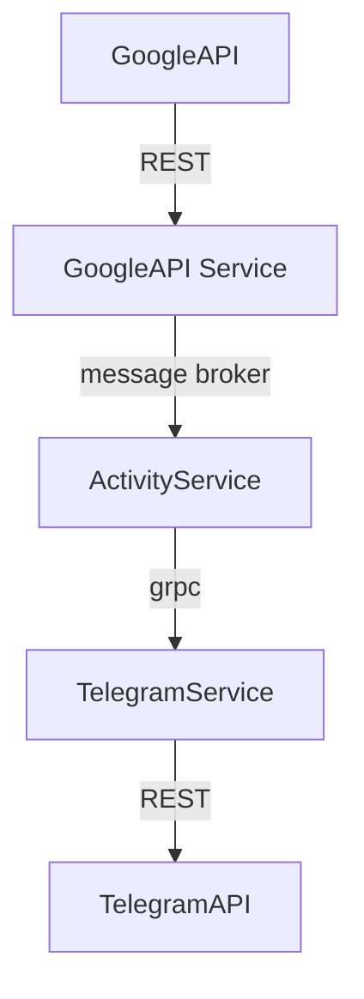

# Where To Telegram Bot

The purpose of the project is to be overengineered. We want to practice as many non-required-by-business-goals technologies as possible. Few, but not all of those include: message brokers, grpc protocol, k8s and microservice architecture and monitoring.

## Suggested app architecture

## Notes on app's architecture

The idea is to overengineer the app the way we communicate with maximum possible ways between our services. At the end of app's business goal cycle the `TelegramService` uses a `Spring` scheduler to send a message in Telegram.

## k8s and monitoring

We would add a couple of additional services for monitoring of our apps. I consider Prometheus for metrics monitoring and Grafana for visual representation of the metrics. At the same time we could add report portal to review test runs results. Oooh, almost forgot `ELK` for logging. By the moment we already have 9 services to run. In a perfect case scenario our apps should be able to scale. At the same time it would be perfect to set up a vpn for maintenance services.

## Services to consider

* `Hashicorp vault`
